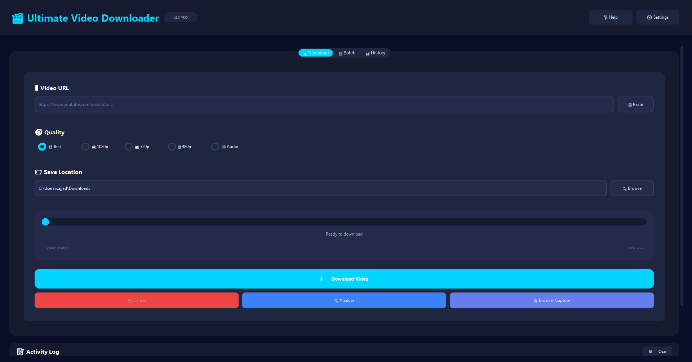
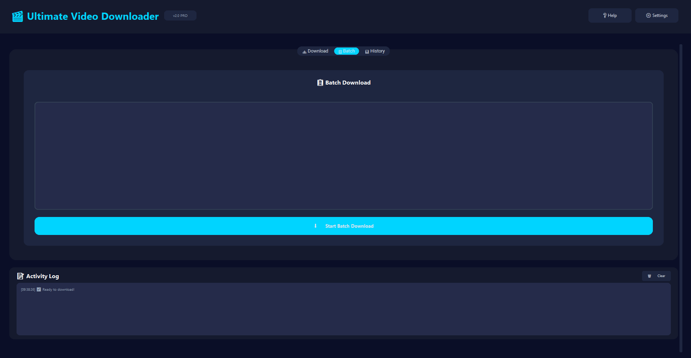
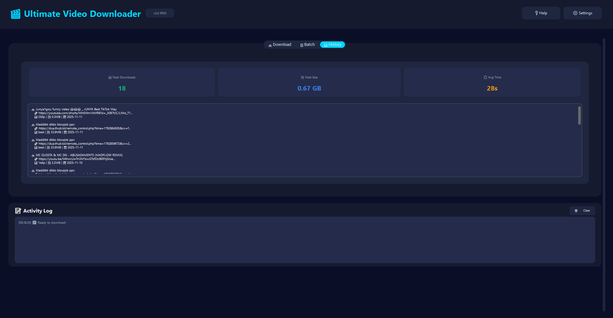

# 🎬 Ultimate Video Downloader


A professional-grade video downloader with enterprise browser capture engine. Download videos from 1700+ sites including YouTube, Twitter, Reddit, and more.


## ✨ Features


- 📹 **Download from 1700+ sites** - Powered by yt-dlp

- 🌐 **Browser Capture Engine** - Intercepts video streams from ANY website

- 🎯 **Smart Quality Selection** - Choose from 4K, 1080p, 720p, 480p, audio-only

- 📊 **Batch Downloads** - Queue multiple videos

- 🗃️ **Download History** - SQLite database tracking

- 🎨 **Modern GUI** - Built with CustomTkinter

- ⚡ **Fast & Reliable** - Multi-threaded downloads

- 🛑 **Cancel Support** - Stop downloads anytime


## 🖼️ Screenshots


### Main Interface




### Batch Download




### Download History




## 📋 Requirements


- Python 3.8 or higher

- Windows 10/11 (for compiled .exe)

- Internet connection


## 🚀 Installation


### Option 1: Run from Source (Recommended for Developers)


1. **Clone the repository:**

# 🎬 Ultimate Video Downloader


A professional-grade video downloader with an enterprise-level browser capture engine. Download videos from 1700+ sites including YouTube, Twitter, Instagram, Reddit, TikTok, Vimeo, and more—even from unsupported sites using advanced stream interception.

## ✨ Features

- 📹 **1700+ Supported Sites** - Powered by yt-dlp for YouTube, Twitter, Reddit, Facebook, and beyond
- 🌐 **Browser Capture Engine** - Intercept and download video streams from ANY website using Playwright automation
- 🎯 **Smart Quality Selection** - Dynamic detection of available qualities: 4K (2160p), 2K (1440p), 1080p, 720p, 480p, 360p, 240p, 144p, Audio-only
- 📊 **Batch Downloads** - Queue and process multiple URLs with consistent quality settings across all videos
- 🗃️ **Download History** - SQLite-based tracking with search, statistics, and export options
- 🎨 **Modern GUI** - Sleek, dark-mode interface built with CustomTkinter for a native Windows experience
- ⚡ **Fast & Reliable** - Multi-threaded downloads with real-time progress, speed tracking, and automatic retry
- 🛑 **Advanced Controls** - Cancel individual/batch downloads, pause/resume, and custom output paths
- 📁 **Smart Organization** - Automatic MP4 conversion, custom folders, and metadata embedding
- 🔒 **Safe & Private** - No telemetry, local database, and secure browser sessions


## 🎥 Quick Start (Demo)

1. **Download the App** (Windows users): Grab the latest release from [Releases](https://github.com/msd-sajjad007/ultimate-video-downloader/releases)
2. **Run & Paste URL**: Open the app, paste a video URL (e.g., YouTube or Twitter)
3. **Analyze & Select**: Click **"Analyze"** to detect qualities, then choose your preferred resolution
4. **Download**: Hit **"Download"** or add to batch for multiple videos
5. **Track Progress**: Watch real-time logs and history updates


## 📋 Requirements

- **Python 3.8+** (for source installation)
- **Windows 10/11** (recommended for compiled .exe; Linux/macOS via source)
- **Internet connection** for downloads
- **Optional**: 2GB+ RAM for browser capture mode

### Python Dependencies
```bash
yt-dlp>=2023.10.13
customtkinter>=5.2.0
playwright>=1.40.0  # For browser capture
sqlite3  # Built-in
pyinstaller  # For building .exe
```

## 🚀 Installation

### Option 1: Run from Source (Recommended for Developers)

1. **Clone the Repository**:
   ```bash
   git clone https://github.com/msd-sajjad007/ultimate-video-downloader.git
   cd ultimate-video-downloader
   ```

2. **Install Dependencies**:
   ```bash
   pip install -r requirements.txt
   ```

3. **Install Browser (for Capture Mode)**:
   ```bash
   playwright install chromium
   ```

4. **Run the App**:
   ```bash
   python video_downloader.py
   ```

### Option 2: Pre-Compiled .exe (Windows Users)

1. Download the latest release from [GitHub Releases](https://github.com/msd-sajjad007/ultimate-video-downloader/releases)
2. Extract `UltimateVideoDownloader-v2.0-Windows.zip`
3. Run `UltimateVideoDownloader.exe` (no installation needed)
4. **Note**: Antivirus may flag it as unknown—safe, but add exception if prompted

### Option 3: Build Your Own .exe

1. Install PyInstaller: `pip install pyinstaller`
2. Run: `pyinstaller video_downloader_COMPLETE.spec`
3. Find the executable in `dist/UltimateVideoDownloader`

## 📖 Usage

### Basic Download
1. Enter a video URL in the **Download** tab
2. Click **"Analyze"** to fetch available qualities
3. Select quality (e.g., 1080p) and output folder
4. Click **"Download"**—progress shows in real-time

### Batch Download
1. Switch to **Batch** tab
2. Add multiple URLs (one per line or paste list)
3. Set global quality and output path
4. Click **"Start Batch Download"**—processes sequentially with unified settings

### Browser Capture (Unsupported Sites)
1. In **Download** tab, check **"Enable Browser Capture"**
2. Paste URL and click **"Analyze"**
3. The engine launches a headless browser, detects streams, and offers download options

### Download History
- Switch to **History** tab to view past downloads

### Tips
- **Quality Selection**: "Best" gets the highest available; specific resolutions (e.g., 720p) cap at that height
- **Batch Quality**: Uses the selected quality for ALL videos—great for consistent playlists
- **Cancel Downloads**: Click the stop button; supports mid-download cancellation
- **Output Paths**: Defaults to `Downloads` folder; customize per download or batch

## 🌐 Supported Sites

Powered by yt-dlp, this supports 1700+ sites out of the box:
- **Video Platforms**: YouTube, Vimeo, Dailymotion, Twitch
- **Social Media**: Twitter/X, Instagram, Facebook, TikTok, Reddit
- **Other**: SoundCloud (audio), Pornhub (NSFW), Live streams
- **Fallback**: Browser Capture for sites without native support (e.g., custom streaming services)

Full list: [yt-dlp supported sites](https://github.com/yt-dlp/yt-dlp/blob/master/supportedsites.md)

## 🔧 Troubleshooting

- **"No video formats found"**: Try Browser Capture mode or check URL validity
- **Playwright errors**: Run `playwright install chromium` and restart
- **Slow downloads**: Check internet; disable VPN if using geoblocked content
- **Antivirus blocks .exe**: Add exception—it's safe (open source!)
- **Quality not available**: Some sites limit resolutions; select "Best" for automatic fallback
- **Batch fails**: Ensure all URLs are valid; check activity log for errors

For more help, open an [issue](https://github.com/msd-sajjad007/ultimate-video-downloader/issues) or check [Discussions](https://github.com/msd-sajjad007/ultimate-video-downloader/discussions).

## 🤝 Contributing

1. Fork the repo
2. Create a feature branch (`git checkout -b feature/amazing-feature`)
3. Commit changes (`git commit -m 'Add amazing feature'`)
4. Push to branch (`git push origin feature/amazing-feature`)
5. Open a Pull Request

We welcome GUI improvements, new site support, or bug fixes!

## 📄 License

This project is licensed under the MIT License - see the [LICENSE](LICENSE) file for details.

## 🙏 Acknowledgments

- [yt-dlp](https://github.com/yt-dlp/yt-dlp) - Core download engine
- [CustomTkinter](https://github.com/TomSchimansky/CustomTkinter) - Beautiful GUI framework
- [Playwright](https://github.com/microsoft/playwright) - Browser automation
- Contributors: [View on GitHub](https://github.com/msd-sajjad007/ultimate-video-downloader/graphs/contributors)

***

⭐ **Star this repo if it helps you!** Questions? Join the [discussion](https://github.com/msd-sajjad007/ultimate-video-downloader/discussions).  

*Built with ❤️ by msd-sajjad007*

